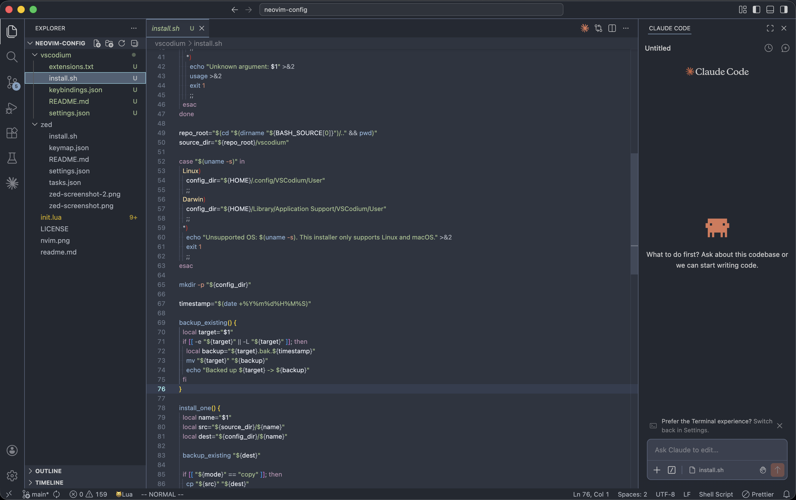

# VSCodium Fallback Setup

This directory contains a repo-managed VSCodium configuration intended as a practical backup to the Neovim setup in this repository. It mirrors the sibling Zed fallback as closely as VSCodium allows.



## Install

Get VScodium from homebrew:

```bash
brew install --cask vscodium
```

```bash
./vscodium/install.sh
```

This installs into:

- Linux: `~/.config/VSCodium/User/`
- macOS: `~/Library/Application Support/VSCodium/User/`

### Default Install Mode

By default, the installer copies `settings.json` and `keybindings.json` into your VSCodium user directory and backs up any existing files of the same name. Extensions are installed via the `codium` CLI from `extensions.txt`.

To track this repo directly:

```bash
./vscodium/install.sh --symlink
```

To skip extension installation:

```bash
./vscodium/install.sh --skip-extensions
```

## External Tools

Expected tools on `PATH`:

- `stylua`: Lua formatting
- `ruff`: Python formatting / linting
- `swiftformat`: Swift formatting
- `typst`: Typst CLI

### Arch Linux

```bash
sudo pacman -S --needed stylua typst ruff
```

### macOS

```bash
brew install stylua ruff typst swiftformat
```

## Extensions

The installer pulls the following from `extensions.txt`:

- `vscodevim.vim`: Vim motions
- `nuromirg.nightfox-theme-collections`: Open VSX port of nightfox.nvim themes, provides Nordfox (matches the Neovim setup)
- `sumneko.lua` + `JohnnyMorganz.stylua`: Lua
- `charliermarsh.ruff` + `astral-sh.ty`: Python (ruff for format / lint, ty for type checking — installed from Open VSX)
- `rust-lang.rust-analyzer`: Rust
- `golang.go`: Go
- `swiftlang.swift-vscode` + `vknabel.vscode-apple-swift-format`: Swift
- `ziglang.vscode-zig`: Zig
- `DanielGavin.ols`: Odin
- `myriad-dreamin.tinymist`: Typst
- `esbenp.prettier-vscode`: JS / TS / JSON / Markdown formatting
- `Anthropic.claude-code`: Claude Code integration

## Suggested Workflow

Vim motions are provided by VSCodeVim. The keybindings layer adds `ctrl-hjkl` for navigating between the sidebar, editor groups, and panel — both inside vim normal/visual modes and in non-editor contexts (sidebar, terminal, etc). `ctrl-arrows` are intentionally not bound on macOS since they collide with Mission Control.

| Shortcut / Command               | Action                                    | Notes                                                  |
| -------------------------------- | ----------------------------------------- | ------------------------------------------------------ |
| `ctrl-h/j/k/l`                   | Navigate between sidebar / editor / panel | Works in normal/visual mode and outside the editor     |
| `cmd-shift-f`                    | Project search / grep                     | Native VSCodium multi-file search                      |
| `cmd-f`                          | In-file search UI                         | Use `enter` / `shift-enter` for next / previous result |
| `/`                              | Vim search                                | Use `n` / `N` for next / previous result               |
| `space q`                        | Open Problems panel                       | Mapped via VSCodeVim leader                            |
| `gcc`                            | Toggle comment on current line            | Vim normal mode (VSCodeVim built-in)                   |
| `gc`                             | Toggle comment on selection               | Vim visual mode                                        |
| `gd`                             | Go to definition                          | VSCodeVim built-in                                     |
| `gA`                             | Find references                           | Mapped via VSCodeVim                                   |
| `cd`                             | Rename symbol                             | Mapped via VSCodeVim                                   |
| `g.`                             | Code actions / quick fix                  | Mapped via VSCodeVim                                   |
| `ctrl-shift-v`                   | Open Markdown preview to the side         | Markdown files only                                    |
| `typst compile path/to/file.typ` | One-shot Typst PDF build                  | Run in the integrated terminal or externally           |
| `typst watch path/to/file.typ`   | Continuous Typst rebuild                  | Run in the integrated terminal while editing           |

## Known gaps

- No integrated Typst preview workflow beyond what `tinymist` provides; `typst compile` / `typst watch` from the terminal remains the supported path.
- Python: `ty` is still pre-release; if it misbehaves, disable the extension and fall back to ruff alone.
- Markdown link / image path completion is not configured.
- No `tasks.json` is shipped; use the integrated terminal for build commands.
