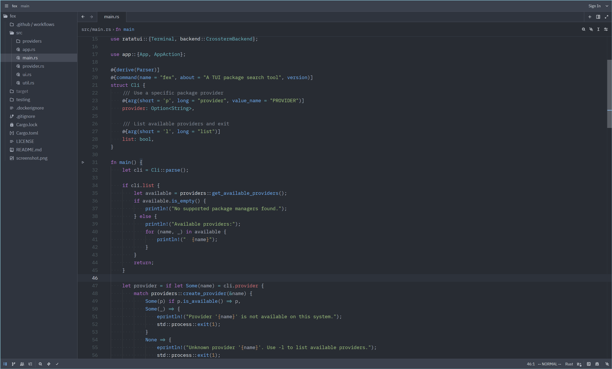
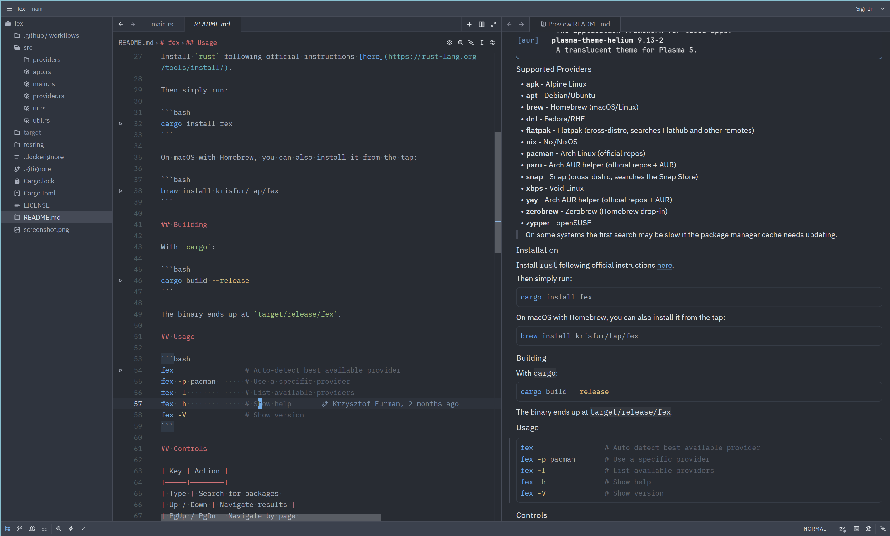

# Zed Fallback Setup

This directory contains a repo-managed Zed configuration intended as a practical backup to the Neovim setup in this repository.





## Install

```bash
./zed/install.sh
```

This installs into `~/.config/zed/` on linux or `~/Library/Application Support/Zed/` on macOS.

### Default Install Mode

By default, the installer copies files into your Zed config directory and backs up any existing `settings.json`, `keymap.json`, or `tasks.json` before replacing them.

If you want the files in your Zed config directory to track this repo directly:

```bash
./zed/install.sh --symlink
```

## External Tools

Expected tools on `PATH`:

- `stylua`: Lua formatting
- `swiftformat`: Swift formatting
- `typst`: required for the terminal-based Typst compile/watch workflow

Suggested installs:

### Arch Linux

```bash
sudo pacman -S --needed stylua typst
```

For `swiftformat`, use the `swift-bin` package source you normally trust for your machine or skip Swift format-on-save until it is installed.

### macOS

```bash
brew install stylua ruff typst swiftformat
```

## Extensions

The settings auto-install these extensions:

- `nord`: Nord theme base
- `lua`: Lua language support
- `swift`: Swift language support
- `zig`: Zig language support
- `odin`: Odin language support
- `typst`: Typst language support

Why these exist:

- `nord` gets the visual baseline close to the current Nordfox setup
- `lua`, `swift`, `zig`, `odin`, and `typst` cover languages that are not all built into Zed by default

## Suggested Workflow

This fallback intentionally uses Zed's native workflow where it is already good, instead of forcing a Neovim leader system that proved unreliable in practice.

Long lines are visually soft-wrapped to the editor width by default. This is display-only and does not insert hard line breaks into files.

| Shortcut / Command                        | Action                            | Notes                                                              |
| ----------------------------------------- | --------------------------------- | ------------------------------------------------------------------ |
| `ctrl-h/j/k/l`, `ctrl-left/right/up/down` | Move between panes                | Works in everything bar the terminal pane                          |
| `g /`, `ctrl-shift-f`, `cmd-shift-f`      | Project search / grep             | Opens Zed's multibuffer search UI                                  |
| `ctrl-f`                                  | In-file search UI                 | Use `enter` / `shift-enter` for next /previous result              |
| `/`                                       | Vim search                        | Use `n` / `N` for next / previous result                           |
| `space q`, `ctrl-shift-m`, `cmd-shift-m`  | Open diagnostics list             | Native alternative: `:clist`                                       |
| `gcc`                                     | Toggle comment on current line    | Vim normal mode                                                    |
| `gc`                                      | Toggle comment on selection       | Vim visual mode                                                    |
| `gd`                                      | Go to definition                  | Zed Vim built-in                                                   |
| `gA`                                      | Find references                   | Zed Vim built-in                                                   |
| `cd`                                      | Rename symbol                     | Zed Vim built-in                                                   |
| `g.`                                      | Code actions                      | Zed Vim built-in                                                   |
| `ctrl-shift-v`                            | Open Markdown preview to the side | Markdown files only                                                |
| `typst compile path/to/file.typ`          | One-shot Typst PDF build          | Run in Zed's terminal or an external terminal                      |
| `typst watch path/to/file.typ`            | Continuous Typst rebuild          | Run in Zed's terminal or an external terminal while editing in Zed |

## Known gaps

- Markdown link and image destinations do not currently get filesystem-aware relative-path completion in this fallback.
- If this is ever added, it should live in a separate extension project rather than inside this repo-managed Zed fallback.
- The supported Typst workflow is terminal-driven `typst compile` / `typst watch`.
- No integrated Typst preview workflow is provided.
- Python uses Zed's built-in `basedpyright` and `ruff`. Environment handling still relies on Zed toolchains and virtualenv detection, not the custom Lua resolver from this Neovim config.
- Custom leader-key workflows were intentionally removed because they proved unreliable in real Zed Vim usage.
